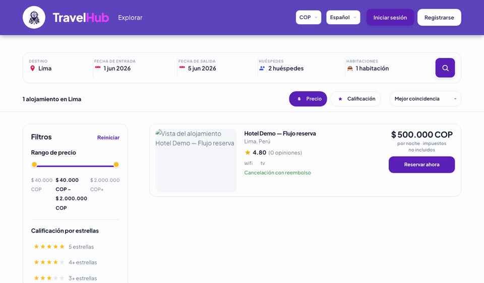
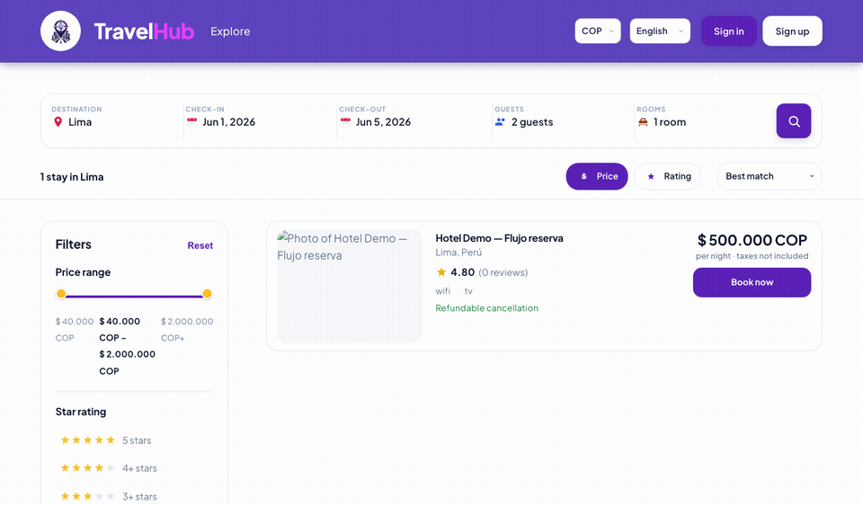

# Pruebas: internacionalización y monedas (portal hotelero)

Este documento describe **qué se cubre hoy con pruebas automatizadas** y **cómo verificar** la internacionalización (i18n) y el manejo de monedas en el portal hotelero de TravelHub Web. Sirve como referencia para QA, revisión de PR y ampliación de cobertura.

---

## Demostración visual: flujo principal de reserva (viajero)

Animaciones generadas desde la propia app (datos **mockeados** en E2E), una por **idioma UI** (`travelhub-lang` en `localStorage`: `es` | `en`). El recorrido es el mismo: búsqueda → detalle → checkout → **comprobante de pago** → **confirmación**. Sirven como evidencia visual de **i18n** (mismo flujo en español e inglés) y de **multi-moneda** (importes en widget, checkout, comprobante y confirmación).

Los GIF están **en la misma carpeta que este archivo** (`docs/`). Abre la **vista previa de Markdown** en el editor (p. ej. en Cursor: icono de previsualización o *Open Preview*) y deberías ver las animaciones debajo sin pasos extra.

### Español (`es`)



### English (`en`)



| Paso | Contenido (ambos idiomas; las etiquetas siguen el `translation.json` activo) |
|------|----------------|
| 1 | Resultados de búsqueda (`/search`, destino Lima, fechas de ejemplo). |
| 2 | Detalle del hotel y reserva desde el widget (tasas FX y `POST /reservation-flow/create` simulados). |
| 3 | Checkout: huésped, método de pago (p. ej. PayPal) y confirmación del pago (`POST /reservation-flow/payment` simulado). |
| 4 | Comprobante (`/payment-voucher`). |
| 5 | Confirmación (`/confirmation`) tras cerrar desde el comprobante. |

### Regenerar el GIF

Requisitos: **Node 20+**, **ffmpeg** en el sistema (`brew install ffmpeg` en macOS) y Chromium de Playwright (`npm run setup:e2e` la primera vez).

```bash
npm run docs:gif
```

Eso ejecuta `RECORD_GIF=1 playwright test e2e/reservation-flow-gif.spec.js` (dos pruebas: `es` y `en`) y `node scripts/png-sequence-to-gif.mjs all`, escribiendo **`docs/reservation-flow-demo-es.gif`** y **`docs/reservation-flow-demo-en.gif`** (junto a este `.md`). Los PNG intermedios quedan en `docs/assets/gif-frames/es/` y `…/en/` (ignorados por git).

**Windows (PowerShell):** si `npm run docs:gif` no define la variable de entorno, ejecutar por separado:

```powershell
$env:RECORD_GIF='1'; npx playwright test e2e/reservation-flow-gif.spec.js --workers=1; node scripts/png-sequence-to-gif.mjs all
```

Archivos involucrados: `e2e/booking-flow-mocks.js`, `e2e/reservation-flow-gif.spec.js`, `scripts/png-sequence-to-gif.mjs`.

---

## Requisitos del proyecto (criterios formales)

Los siguientes criterios deben **tenerse en cuenta** al planificar pruebas, documentar evidencias y cerrar hitos. Resumen alineado con la matriz de pruebas del sistema:

| Nivel | Tipo | Método | Objetivo |
|--------|------|--------|----------|
| Sistema | Funcional | **API automatizada** | Validar la internacionalización en un **50%** (nivel de cobertura acordado) sobre la **pantalla de detalle de una reserva** en la aplicación web. **Estado medido en repo:** véase **§2.3** (~**0%** automatizado en textos de detalle; **~5%** en portal tarifas). |
| Sistema | Funcional | **Pruebas funcionales manuales** (+ integración donde aplique) | Validar la correcta implementación del **mecanismo multi-moneda**, ejecutando pruebas funcionales e integración sobre al menos el **30% de los flujos críticos de confirmar reserva**, con **consistencia de la información** en todos los países soportados por la plataforma web. |

### Cómo se traduce esto en este repositorio

**i18n al 50% en detalle de reserva (automatizado)**

- La “API automatizada” en front suele interpretarse como **pruebas automáticas** que validan contratos de datos y textos traducibles, sin depender solo de prueba manual.
- Ámbito **detalle de reserva**: claves `reservationData.*` y pantallas de detalle (viajero: “Mis viajes” / reserva; hotelero: detalle bajo rutas de gestión), mapeos desde DTO en `src/services/api.js` (`mapUserReservationDto`, `mapApiReservationToTripDetail`, etc.) y componentes que consumen `t("reservationData....")`.
- **Medir el 50%**: conviene definir una lista finita de ítems (p. ej. títulos de estado, pagos, segmentos, mensajes de error, fechas auxiliares) y comprobar que la mitad o más esté cubierta por tests automatizados (Vitest: componente + mappers) o por un job de API/contrato si el backend expone verificación de locale.

**Multi-moneda al 30% de flujos críticos de confirmación (manual + integración)**

- Inventariar **flujos críticos** de “confirmar reserva” (ej.: checkout con COP, con USD, con conversión FX; confirmación en email/UI; lectura coherente en detalle y en listado).
- Garantizar evidencia documentada de que se ejecutó **≥30%** de ese conjunto en **pruebas funcionales manuales** y, donde corresponda, **pruebas de integración** (E2E o llamadas encadenadas front–API).
- **Consistencia entre países / mercados**: mismo contrato de `currency_code` / totales mostrados vs. almacenados; formato localizado según moneda (`formatHotelPortalMoney`, `formatPaymentInDisplayCurrency`); tasas FX acordes al flujo.

Las secciones siguientes detallan la implementación técnica y los archivos de prueba actuales; al cumplir las metas anteriores, actualizar esta sección con **evidencia** (porcentajes medidos, lista de flujos ejecutados y fecha).

---

## 1. Alcance

| Área | Descripción |
|------|-------------|
| **i18n** | Textos del dashboard, navegación, tablas, gráficos, gestión de reservas/tarifas y datos de reserva asociados a rutas bajo `/hoteles/…`. Claves agrupadas en `hotelPortal`, `hotelManage`, `reservationData` (y mensajes relacionados en `translation.json`). |
| **Monedas** | Divisas admitidas en portal (**COP** / **USD**), normalización, formato de importes en UI (`formatHotelPortalMoney`), persistencia de moneda del portal hotelero, moneda opcional en login, conversión FX en API (incl. fallback), y moneda de visualización del viajero donde aplica. |

La interfaz del viajero (búsqueda, checkout, “Mis viajes”) tiene sus propias claves i18n; aquí el foco es **portal hotelero + utilidades compartidas de moneda** que impactan ambos lados.

---

## 2. Internacionalización (i18n)

### 2.1 Implementación

- **Biblioteca:** `i18next` + `react-i18next` (configuración en `src/i18n`).
- **Idiomas:** Español (`es`) e inglés (`en`), recursos en:
  - `src/locales/es/translation.json`
  - `src/locales/en/translation.json`
- **Tests:** `tests/setup.js` fija el idioma por defecto a **`es`** antes de cada prueba (`i18n.changeLanguage("es")`), de modo que los tests de componentes que buscan texto en español sean estables.

### 2.2 Claves relevantes al portal hotelero

| Bloque JSON | Uso típico |
|-------------|------------|
| **`hotelPortal`** | Dashboard (`HotelPortalPage`), sidebar, métricas, gráfico de ingresos, próximas llegadas, paginación, ARIA, nombres de mes (`monthsList`), pluralización (`bookingUnit_one` / `_other`), `tooltipMoney`, navegación lateral (`nav.*`). |
| **`hotelManage`** | Listado y filtros de reservas, columnas de tabla, ordenación, textos de “noche(s)”, acciones. |
| **`reservationData`** | Detalle de reserva (estado, pagos, segmentos, textos de carga y “sin datos”). |

Las cadenas con interpolación (`{{name}}`, `{{month}}`, `{{from}}–{{to}}`, etc.) deben mantener los mismos **placeholders** en `es` y `en` para no romper la UI.

### 2.3 Cobertura estimada de las pruebas de internacionalización

Las cifras siguientes son **indicadores** para seguimiento del criterio formal (≈**50%** en **detalle de reserva** vía automatización). Se recalculan contando **cadenas hoja** en `src/locales/es/translation.json` (objetos anidados contados como unidades independientes) y las pruebas que **fijan el idioma `es`** y **comprueban texto** que proviene de `t(...)` (Vitest / Testing Library).

#### Inventario de cadenas (referencia)

| Ámbito en `translation.json` | Bloques incluidos | Cadenas hoja (aprox.) |
|--------------------------------|-------------------|------------------------|
| **Detalle de reserva** (viajero + hotelero + datos compartidos) | `tripDetail`, `hotelReservationDetail`, `reservationData` | **75** |
| **Portal hotelero (UI)** | `hotelPortal`, `hotelManage`, `hotelManageRates`, `hotelRoomDetail`, `hotelRoomCalendar` | **117** |

#### Porcentajes respecto a la meta

| Métrica | Valor | Cómo se interpreta |
|---------|--------|----------------------|
| **Detalle de reserva — pruebas automatizadas que validan textos `t(...)`** | **≈0%** de las **75** cadenas | No hay hoy tests de componente para `TripDetailPage` ni `HotelReservationDetailPage` que aserten etiquetas `tripDetail.*` / `hotelReservationDetail.*`. Los tests de API (`mapUserReservationDto`, `getHotelReservationDetailFromApi`) validan datos, **no** traducciones. |
| **Portal hotelero — pruebas Vitest que aserten cadenas en español** | **≈5%** de las **117** cadenas (~**6** aserciones sobre rutas visibles: calendario de tarifas, modales, textos de acción en `tests/components/hotel-portal/*`) | Cobertura **parcial** solo en la zona de **gestión de tarifas / calendario**; el dashboard, sidebar, listado de reservas del portal, etc., no tienen aserciones de i18n automáticas. |
| **Flujo viajero (búsqueda → checkout)** | **Cobertura visual E2E** (`e2e/reservation-flow-gif.spec.js`) | El GIF demuestra el recorrido en **es**, pero **no** sustituye asserts reproducibles; no cubre la pantalla **detalle de reserva** (“Mis viajes” / detalle slug). |

**Brecha con la meta del 50% (detalle de reserva):** hace falta subir la cobertura automatizada (p. ej. tests de componente o E2E que lean `screen.getByRole` / `getByText` con claves del detalle, o pruebas bajo `i18n.changeLanguage("en")` para paridad). Actualizar esta tabla cuando se añadan esas pruebas (fecha y commit de referencia).

### 2.4 Pruebas automatizadas relacionadas

| Archivo | Qué valida respecto a i18n / UI localizada |
|---------|--------------------------------------------|
| `tests/components/hotel-portal/HotelRoomCalendarTable.test.jsx` | Títulos y botones en español (“Calendario…”, “Buscar”, “Editar tarifa”) — asume idioma `es` del setup. |
| `tests/components/hotel-portal/HotelRoomRateModal.test.jsx` | Flujo de modal de tarifa (etiquetas según locale del test). |
| `tests/components/hotel-portal/HotelRoomBulkRateModal.test.jsx` | Modal de tarifas masivas. |

**No** hay hoy una suite dedicada que cambie explícitamente a `en` y compare todas las pantallas del portal; eso suele cubrirse con **pruebas E2E** (por ejemplo Playwright) o checklist manual.

### 2.5 Verificación manual recomendada (i18n)

1. Cambiar el idioma de la aplicación al flujo expuesto en UI (si existe selector global) o forzar `i18n.changeLanguage("en")` en entorno de desarrollo.
2. Recorrer: **Dashboard** (`/hoteles/inicio`), **Gestionar reservas**, **Tarifas** / calendario de habitaciones, **detalle de reserva** hotelera.
3. Comprobar que no queden cadenas hardcodeadas sin `t(...)` y que fechas/números sigan siendo legibles en inglés.

---

## 3. Monedas

### 3.1 Reglas de negocio en código

| Módulo | Rol |
|--------|-----|
| `src/constants/hotelCurrency.js` | `normalizeHotelCurrencyCode`: solo **USD** o **COP**; cualquier otro valor → **COP**. |
| `src/constants/fxCurrency.js` | `normalizeFxCurrencyCode`: contrato más amplio (ISO + `USDC`) para FX; inválido → **USD**. |
| `src/utils/formatHotelPortalMoney.js` | Formato de importes para el portal (`formatHotelPortalMoney`, `formatFlexibleMoney`, sufijos ISO). |
| `src/auth/hotelPortalCurrency.js` | Lee/escribe moneda operativa del hotel en `localStorage` / `sessionStorage`; sincroniza desde payloads de API/analytics. |
| `src/auth/sessionAuth.js` | Tras login, si el rol es hotel y viene `hotelCurrencyCode`, persiste en portal currency. |
| `src/auth/travelerDisplayCurrency.js` | Moneda de **visualización** del viajero (selector COP/USD), independiente del portal hotelero. |
| `src/services/api.js` | Tasas FX, conversión, reservas con conversión USD→COP, mappers de habitaciones con `currency_code`, etc. |
| `src/utils/fxFrankfurterFallback.js` | Fallback público si falla el servicio FX interno. |

### 3.2 Pruebas automatizadas (monedas y FX)

| Archivo | Contenido |
|---------|-----------|
| `tests/utils/formatHotelPortalMoney.test.js` | `normalizeHotelCurrencyCode`, `formatHotelPortalMoney` (variantes `detail` / `compact`, `NaN` → "—"), `formatFlexibleMoney`, `formatFlexibleMoneyWithIsoSuffix`. |
| `tests/auth/hotelPortalCurrency.test.js` | `get/set/clear` moneda portal, prioridad local vs sesión, `pickHotelCurrencyFromApiPayload`, `syncHotelPortalCurrencyFromAnalyticsDto`, tolerancia a errores de storage, caso sin `window` (SSR). |
| `tests/auth/travelerDisplayCurrency.test.js` | Valor por defecto **COP** y persistencia **USD**. |
| `tests/auth/sessionAuth.test.js` | `persistSessionFromLogin` con `hotelCurrencyCode` para rol hotel (persistencia en storage portal). |
| `tests/constants/fxCurrency.test.js` | `normalizeFxCurrencyCode` (ISO, `USDC`, inválidos, `null`/`undefined`). |
| `tests/utils/fxFrankfurterFallback.test.js` | Activación del fallback y peticiones Frankfurter. |
| `tests/utils/fxConversion.test.js` | Extracción de tasas / conversión en utilidades FX. |
| `tests/services/api.test.js` | `createReservation` con tasa válida; error **503** si el payload de tasas no tiene tasa usable; mappers con amenidades y moneda en habitaciones; otros flujos que tocan `currency_code` / FX según el suite. |

---

## 4. Cómo ejecutar las pruebas

Desde la raíz del paquete `travelhub-web`:

```bash
npm test
```

Cobertura (incluye `src/auth`, `src/services`, `src/constants`, `src/bookings`; la UI en `src/pages` / `src/components` está pensada sobre todo para E2E):

```bash
npm run test:coverage
```

---

## 5. Huecos y mejoras sugeridas (incl. criterios § requisitos formales)

| Tema | Sugerencia |
|------|------------|
| **Meta i18n 50% detalle reserva** | Contar ítems de `reservationData` + strings dinámicos en la página de detalle; ampliar Vitest/E2E hasta alcanzar el porcentaje acordado; conservar trazabilidad para auditoría. |
| **Meta multi-moneda 30% flujos críticos** | Documentar la lista de flujos “confirmar reserva” y marcar cuáles se ejecutan manualmente / en integración cada release o sprint. |
| i18n **en** en portal hotelero | Añadir tests que llamen `i18n.changeLanguage("en")` y usen `getByRole`/`getByText` con copy en inglés para pantallas críticas (especialmente **detalle de reserva**), o E2E bilingüe. |
| Paridad **es** / **en** JSON | Revisar en CI o script que las claves de `hotelPortal` / `hotelManage` / `reservationData` existan en ambos archivos. |
| Monedas en UI | Los tests actuales cubren **utilidades y API**; las pruebas manuales deben cubrir totales y símbolos coherentes con el país/moneda del flujo crítico. |

---

## 6. Referencia rápida de archivos

- Traducciones: `src/locales/es/translation.json`, `src/locales/en/translation.json`
- Setup de tests i18n: `tests/setup.js`
- Formato money portal: `src/utils/formatHotelPortalMoney.js`
- Moneda portal (storage): `src/auth/hotelPortalCurrency.js`

*Documento generado para el equipo TravelHub Web; actualizar al añadir nuevas pantallas del portal hotelero o nuevas divisas en el contrato del backend.*
